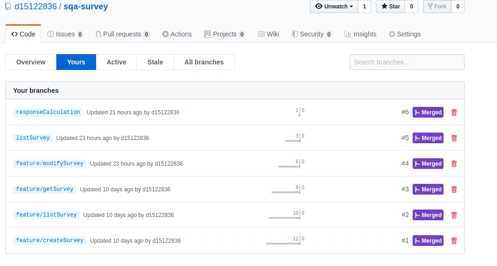
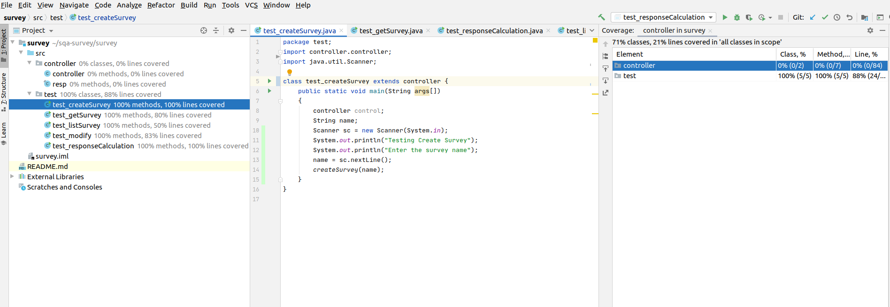

# Software Quality Assurance - Survey

## Introduction

In today's world, almost every individual is taking certain kind of services from various platforms or institutions. These services can be of any form such as software services, medical services, transport services etc.. In order to improve the services, feedbacks plays an important role. Feedbacks are the responses given out by the customers to the service providers. It helps the service providers to improve or maintain the quality of services. Therefore, in our project we have developed an application which provides certain functionalities such as creating surveys, calculating the responses, list surveys etc.. In the documentation, we have explained how the given objective of creating such application is achieved following an industry standard software development approach.

## Components

An industry standard software development approach includes various components that needs to be cleary defined before writing the code. Therefore, we have defined following components prior to writing the code.

1. Road Map
2. Software Development Model

3. Backlog Refinement
4. Unit Testing
5. Code coverage tool
6. Team version control
7. Code Review

## Road Map

## Software Development Model

## Backlog Refinement

In a agile software development approach, a project is divides into several small tasks which are estimated to be completed within a week or two. Generally a sprint is of 2 weeks that is 10 working days.
Therefore, a backlog is defined which contains all the tasks that are required to be carried out in the following sprint. The tasks in the backlogs are generally defined ahead of 2-3 sprints. However, there is a continuous updation of the backlog as certain tasks are added during the ongoing sprints. For our project also we have defined a backlog that speicifies the tasks that are required to be carried out. However, we continously added stories (tasks) while working on other tasks, as all the tasks cannot be determined before the start of the project.

The tasks added in the backlog are put in the order in which they need to be carried out. The most important tasks such as setting up environment are put on top and the least important tasks such as GUI enhancement are put at the below.

### Project Backlog

**Story 1** : Setting up a working environment

* Acceptance Criteria : Setting up softwares such as IntelliJ for code writing, Visual Studio Code for report writing.

* Story points : 0.5

**Story 2** : Setting up a Github account

* Acceptance Criteria : Setting up a github account to enable the gitflow process.

* Story Points : 0.5

**Story 3** : Figuring out the road map for the project and plan to complete the project with in a given time frame.

* Acceptance Criteria : Well documented plan explaining all the requirements of the project.

* Story points : 1

**Story 4** : Develop controller class as per the project requirement.

* Acceptance Criteria : Implement create survey function in the controller class

* Story points : 1

**Story 5** : Develop controller class as per the project requirement.

* Acceptance Criteria : Implement list survey function in the controller class

* Story points : 1

**Story 6** : Develop controller class as per the project requirement.

* Acceptance Criteria : Implement get speific survey function in the controller class

* Story points : 1

**Story 7** : Develop controller class as per the project requirement.

* Acceptance Criteria : Implement modify survey function in the controller class

* Story points : 1
  
**Story 8** : Develop controller class as per the project requirement.

* Acceptance Criteria : Implement get survey response function in the controller class

* Story points : 2

**Story 9** : Develop controller class as per the project requirement.

* Acceptance Criteria : Implement calculate survey response function in the controller class

* Story points : 1

**Story 10** : Develop other java class  to call functions of controller class

* Acceptance Criteria : Implement function calls in the java class

* Story points : 4

**Story 11** : Define code coverage tool

* Acceptance Criteria : Implement a code coverage tool and attach the screenshot in the report.

* Story points : 1

**Story 12** : Define Team version control in the readme file for the project

* Acceptance Criteria : Number of branches created with their use cases is defined in the readme file.
  
* Story points : 1

**Story 13** : Define Code review checklist in the readme file for the project.

* Acceptance Criteria : Checklist for the code reviewers is well defined in the readme file.
  
* Story points : 1

### Task Estimation

For our backlog, we defined certain stories that are required to successfully implement a project. The stories in the backlog are ordered considering their dependencies on the other tasks. The tasks of setting up a working environment is put at the top of the backlog as it is the first tasks that should be carried out before working on the other tasks and all the other tasks are highly dependant on the completion of this task.

Also, for every tasks we have assigned story points which are multiples of 2. We can follow any sequence such as fibonacci etc.. in order to maintain a uniformity. The story points defines the time for completion of the task. It can vary as per the team. For our project, we are referring story points as per the below:

* 0.5 : 4 hours or half working day
* 1   : 8 hours or full working day
* 2   : 2 working days
* 4   : 4 working days
  
Every task that is estimated to be over 4 story points, is broken down to smaller tasks which can be of 1,2 and 4. For example, implementing a controller class can be a task of 8 story point but it was divided into smaller tasks as per each function.

#### Velocity metrics

The velocity metrics is used to calculate the performance of the team. It tells us the progress made by the team as the number of sprints passes. The velocity is calculated by dividing the number of story points a team plans to do in a sprint to the number of working days each team member is commiting to the sprint. The target is calculated before the start of the sprint and analyze whether it has been achieved or not at the end of the sprint.

## Team Version control

In our project, we have created a seperate branch for each feature implemented so that every team member can work individually on their feature. In the below screenshot, we can see that total 6 branches were created to carry out the tasks and were merged to achieve the main objective. All the feature branches were independent of each other. However, there were some features which were heavily dependent on the other features for their completion. Due to this those tasks were pulled in the sprint first and implemented.

## Code Review checklist

This checklists includes certain keypoints that should be kept in mind while reviewing the code and before merging it in the master branch. These are as follows:-

1. Is the code understandable to a new developer.
2. Coding standards followed while writing the code.
3. Duplication of the code.
4. Are the test cases defined for the code so as to debug easily in future.
5. Code complexity, reliability and also determine whether code can handle in future modifications.

## Unit Testing

In order to test the functioning of our code, we have written test cases for every function required for survey. These tests helps the developers to determine whether the code is appropriate and meets the requirement for the project. We have created a seperate test package containing all the test cases required for carrying out the tests.

## Code coverage tool

For our project, we used Junit tool as a code coverage tool. This tool is an inbuilt feature of Intellij and most widely used as a code coverage tool. In the below screenshot, we can see the how it was executed on our code. It was successfully implemented on our code. It has a great coverage percentage of the code. For every file in our project, we can see a coverage percentage which is further classified into percentage of lines,methods and classes covered.

